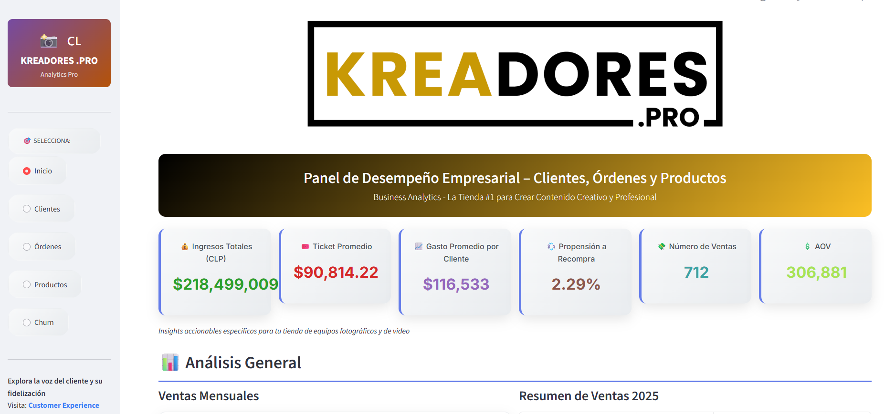

# Kreadores Data Pipeline & Dashboard


## Descripción

`Kreadores Data Pipeline & Dashboard` es un repositorio integral para la gestión y análisis de datos de e-commerce. Combina un pipeline ETL con Prefect y Supabase, módulos reutilizables de transformación de datos, notebooks de experimentación (incluyendo un modelo de churn), y una aplicación interactiva en Streamlit que expone métricas clave, KPIs y visualizaciones dinámicas.

👉 [Ver el dashboard en línea](https://business-dashboard-kreadores.onrender.com)



## Contenido principal

* [etl](https://github.com/Halsey26/pipeline_perc/tree/main/etl) — Código de extracción y transformación. Incluye la funciones para obtener datos desde Supabase y normalizarlos.
* [notebooks](https://github.com/Halsey26/pipeline_perc/tree/main/notebooks) — Jupyter notebooks para análisis exploratorio, desarrollo y pruebas (por ejemplo `eda`).
* [prefect_flows](https://github.com/Halsey26/pipeline_perc/tree/main/prefect_flows) — Flujos de Prefect para orquestar tareas ETL (si los usas para producción/local scheduler).
* [streamlit_app](https://github.com/Halsey26/pipeline_perc/tree/main/streamlit_app) — App de Streamlit (dashboard). Archivo principal: [pipeline_perc/streamlit_app/App.py](https://github.com/Halsey26/pipeline_perc/blob/main/streamlit_app/App.py).
* [requirements.txt](https://github.com/Halsey26/pipeline_perc/blob/main/requirements.txt) — Dependencias del proyecto.
* `README.md` — (este documento)

---

## Requisitos previos

* Python 3.8+ (recomendado 3.9/3.10)
* Git
* Una cuenta y tabla(s) en Supabase (si quieres usar extracción directa)

Variables de entorno recomendadas [Configuración .env](https://github.com/Halsey26/pipeline_perc/blob/main/documentacion/variables_config.md):

> ⚠️ No compartas claves privadas en el repo. Usa secretos del entorno en Render o GitHub Actions.

---

## Instalación (local)

1. Clona el repo:

```bash
git clone https://github.com/Halsey26/pipeline_perc.git
cd pipeline_perc
```

2. Crea y activa un entorno virtual (opcional pero recomendado):

```bash
python -m venv .venv
# Linux/macOS
source .venv/bin/activate
# Windows (PowerShell)
.\.venv\Scripts\Activate.ps1
```

3. Instala dependencias:

```bash
pip install -r requirements.txt
```

4. Crea un archivo `.env` (o exporta variables) para las credenciales de Supabase:

```
SUPABASE_URL=...
SUPABASE_KEY=...
...
```

---

## Ejecutar localmente

### Streamlit (dashboard)

Si tu archivo principal es `streamlit_app/Inicio.py`:

```bash
streamlit run streamlit_app/Inicio.py
```

> Si despliegas en Render, la plataforma proporciona la variable `$PORT`. En general Streamlit detecta el puerto, pero si hay problemas puedes forzar la lectura de `PORT` dentro del entrypoint. (Ver secciones de Deploy abajo.)

### Notebooks

Arranca JupyterLab/Notebook desde la raíz del repo para que las importaciones relativas funcionen:

```bash
jupyter lab
# o
jupyter notebook
```

En notebooks, si arrancas desde otra carpeta, añade al `sys.path` la raíz del proyecto:

```python
import os, sys
sys.path.append(os.path.abspath(".."))  # ajustar según ubicación
```

---

## Estructura recomendada y buenas prácticas

* Mantén las credenciales fuera del repo (`.env`, secretos en la plataforma de deploy).
* Evita dependencias pesadas si vas a deployar en plataformas con memoria limitada (Render free tier tiene límites). Si tu `requirements.txt` tiene `torch` o librerías grandes, considera removerlas o usar un servicio con más recursos.
* Documenta el contrato de tablas esperadas (nombres de columnas esenciales: `id_cliente`, `id_orden`, `precio_total`, `fecha_creacion`, `estado_orden`, etc.).

---

## Deploy en Render (guía rápida)

A modo de recordatorio de tu configuración:

* **Branch**: `main`
* **Root directory**: `.` (si `requirements.txt` está en la raíz)
* **Build command**: `pip install -r requirements.txt`
* **Start command**: `streamlit run streamlit_app/Inicio.py`

**Consejos para evitar fallos por "peso":**

* Revisar `requirements.txt` localmente: instalar en un entorno limpio para medir tiempo y tamaños.
* Eliminar librerías innecesarias o mover cargas pesadas a servicios externos.
* Para Streamlit en Render, si hay problemas con el puerto, modifica el entrypoint para leer `PORT` de entorno y pasarla a Streamlit.

---

## Notas sobre ETL y uso de Supabase

* `etl.extract` debe contener funciones para consultar Supabase (por ejemplo `extract_supabase`) y devolver `pandas.DataFrame`.
* Las tablas de Supabase pueden cambiar en filas sin romper la app; cambios en la **estructura (nuevas columnas/renombradas)** sí requieren actualizar el código.

---

## Uso típico (ejemplo rápido)

* Extraer datos con `extract_supabase()`
* Limpiar y transformar en `etl/` → producir `products`, `orders`, `orders_products`, `customers`
* Calcular KPIs (funciones en `streamlit_app` o utilitarios)
* Visualizar en Streamlit

---

## Contribuciones

Si quieres colaborar:

1. Haz fork del repo
2. Crea una rama `feature/...`
3. Abre Pull Request con descripción clara
