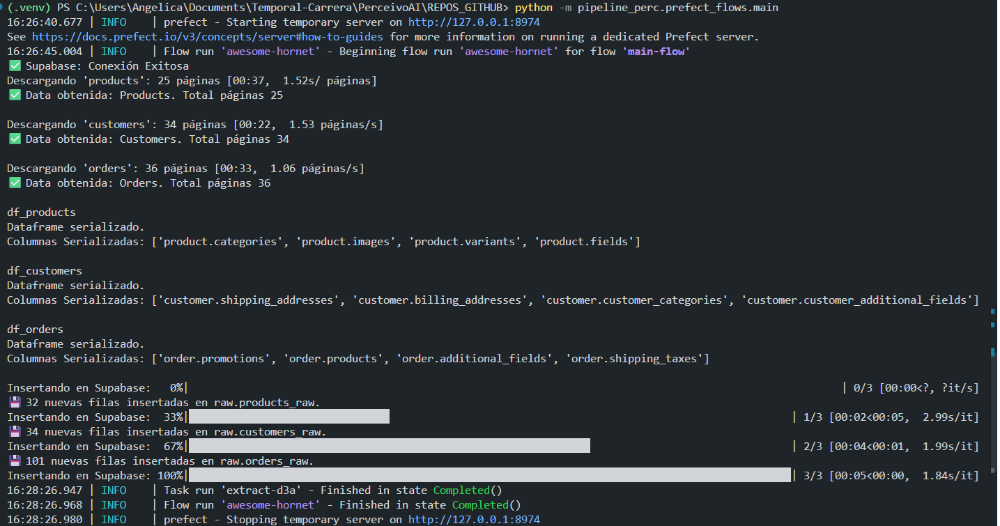

# README — `prefect_flows/main.py`

Documento detallado que explica propósito, uso y recomendaciones para el archivo `prefect_flows/main.py` del proyecto `pipeline_perc`.

---

## 1. Resumen

`prefect_flows/main.py` es el orquestador Prefect del pipeline ETL. Define 3 tareas (`extract`, `transform`, `load`) como `@task` y el `flow` principal `main_flow()` que encadena la ejecución. El propósito es extraer datos desde fuentes (ej. Jumpseller/Supabase), normalizarlos y cargarlos en esquemas `raw` y `clean` de Supabase.

El archivo también contiene la lógica para **desplegar** el flujo usando un `GitHubRepository` (Prefect GitHub Repository Block) y el método `from_source(...).deploy(...)` para publicar la definición en el servidor/Cloud de Prefect.

---

## 2. Requisitos previos

* Python 3.8+
* `pip install -r requirements.txt` (ver archivo `requirements.txt` para versiones exactas)
* Cuenta y proyecto en Supabase con credenciales (`SUPABASE_URL`, `SUPABASE_KEY`).
* (Opcional) Cuenta en Prefect Cloud o Prefect Server para desplegar y ejecutar los flows.
* Bloques en Prefect: un `GitHubRepository` registrado con el nombre usado en `GitHubRepository.load("prefect-repo")` (o cambiar el string por el nombre real de tu bloque).

---

## 3. Variables de entorno necesarias

Coloca estas variables en un archivo `.env` (no subir al repo) o configúralas como secretos en Prefect:

```
SUPABASE_URL=...
SUPABASE_KEY=...
JUMPSELLER_LOGIN=...
JUMPSELLER_AUTHTOKEN=...
```

> Nota: para deploy en Prefect, es preferible usar **Secrets / Blocks** de Prefect para no exponer credenciales en variables globales.

---

## 4. Estructura y componentes claves

* **Imports ETL**: el flow importa funciones de `pipeline_perc.etl.extract`, `pipeline_perc.etl.transform`, `pipeline_perc.etl.load`:

  * `obtener_datos`, `conect2supabase`, `preprocessing_supabase`, `extract_supabase`
  * `transform_customers`, `transform_orders`, `transform_products`, `create_orders_products`
  * `insert2supabase`

* **Supabase client**: se crea un cliente con `create_client(url, key)` usando las variables de entorno.

* **`endpoints`**: lista de tablas a procesar: `['products', 'customers', 'orders']`.

* **Tareas (Prefect)**:

  * `extract(endpoints, login, authtoken)`

    * Llama a `obtener_datos` por endpoint.
    * Aplica `preprocessing_supabase` a cada dataframe.
    * Inserta los datos en el esquema `raw` usando `insert2supabase`.

  * `transform(endpoints, supabase_cliente)`

    * Lee tablas desde Supabase (`extract_supabase` con esquema `raw`).
    * Ejecuta la función de transformación específica (`transform_<endpoint>`) obtenida dinámicamente vía `globals()`.
    * Crea `orders_products_clean` con `create_orders_products`.
    * Retorna `dataframes_clean`.

  * `load(dataframes_clean)`

    * Inserta cada dataframe limpio en el esquema `clean` de Supabase.

* **Flow principal**:

  * `main_flow()` que ejecuta `extract`, luego `transform`, luego `load`.

* **Despliegue**:

  * En `if __name__ == "__main__"` el script carga `GitHubRepository.load("prefect-repo")` (debe existir) y ejecuta `main_flow.from_source(...).deploy(...)` para publicar el flow en Prefect.

---

## 5. Cómo ejecutar localmente (pruebas)


**Configuración local (opcional)**  
Si trabajas con un Prefect Server local o quieres apuntar la CLI a una URL específica, puedes configurar la variable así:

```bash
# Apunta la CLI/SDK al API de Prefect (ejemplo local)
prefect config set PREFECT_API_URL="http://127.0.0.1:4200/api"
```


### A) Ejecutar todo directamente (modo desarrollo)

Desde la raíz del repositorio (donde `pipeline_perc` está disponible):

```bash
python -m prefect_flows.main
```

Antes de desplegar en Prefect, puedes probar las funciones llamando `main_flow()` directamente (descomentar la línea `main_flow()` en el `if __name__ == "__main__"`). Esto ejecuta el flow localmente sin necesidad de Prefect Cloud.

### B) Ejecutar tareas individualmente

* Importa las funciones en un REPL o script y ejecuta `extract(...)`, `transform(...)` o `load(...)` para debug.

### C) Requisitos para que funcione localmente

* Tener las credenciales en `.env` y usar `dotenv.load_dotenv()` (ya incluido en el script).
* Tener acceso a la base Supabase (red/credenciales correctas).

---

## 6. Cómo desplegar en Prefect (Cloud / Server)

1. En la UI de Prefect crea un bloque `GitHubRepository` apuntando al repo `Halsey26/pipeline_perc` y dale el nombre que usarás (p. ej. `prefect-repo`).
2. Crea un Work Pool y un Worker (o configura agentes) para ejecutar los runs.
3. Actualiza las credenciales como **Secrets** o Blocks en Prefect (no uses variables de entorno sin protección en Cloud).
4. En el script `main.py` se llama `main_flow.from_source(...).deploy(...)`. Al ejecutar el script (localmente o en CI), esto registrará la deployment en Prefect usando el `GitHubRepository` como `source`.
5. En la UI de Prefect verás la deployment creada y podrás ejecutar manualmente o con schedule.

> Observación: `GitHubRepository.load("prefect-repo")` busca un bloque ya registrado con ese nombre. Asegúrate de que el nombre coincida con el bloque creado en Prefect.

---

## 7. Recomendaciones y buenas prácticas

* **Usar Blocks para credenciales**: en lugar de leer `SUPABASE_KEY` directamente, guarda estas credenciales en Prefect Secret/Block y recupéralas dentro del flow.

* **Idempotencia**: asegura que `insert2supabase` sea idempotente: evita duplicar filas en iteraciones repetidas (usar upsert o truncado/con control de batch IDs).

* **Retries y timeouts**: añade `retry` y `timeout_seconds` a `@task` si el endpoint es inestable. Ejemplo:

```python
@task(retries=3, retry_delay_seconds=30)
def extract(...):
    ...
```

* **Logs y monitoreo**: usar logging en lugar de `print` para que Prefect capture los logs apropiadamente.

* **Validaciones y contratos**: validar que las columnas esperadas existen antes de procesar y lanzar errores claros si no.

* **Versionar transformaciones**: si cambias transformaciones, versiona la salida (p. ej. una columna `_etl_version`) para reproducibilidad.

* **Escalabilidad**: si los dataframes son grandes, evita traer todo en memoria; procesa por batches o usa un motor columnar (BigQuery / Snowflake) según crecimiento.

---

## 8. Posibles mejoras inmediatas (PR sugeridos)

1. **Quitar duplicados**: el archivo contiene código repetido. Mantener una única definición limpia.
2. **Usar Blocks/Secrets**: mover lectura de credenciales a bloques de Prefect.
3. **Agregar typing y docstrings** a cada `task` y `flow`.
4. **Añadir tests unitarios** para `transform_*` y `insert2supabase` (mocks de Supabase).
5. **Manejo de errores** y notificaciones (Slack / email) en caso de fallo.
6. **Paralelizar** transform cuando sea seguro (Prefect puede ejecutar tareas en paralelo si no dependen entre sí).

---

## 9. Troubleshooting común

* **`GitHubRepository.load("prefect-repo")` falla**: Verifica que exista el bloque con exactamente ese nombre en tu Prefect UI.
* **Credenciales de Supabase inválidas**: revisa `SUPABASE_URL` y `SUPABASE_KEY`; prueba crear un cliente con `supabase.create_client()` en un REPL.
* **Errores en `insert2supabase` por esquema distinto**: verifica nombres de columnas y tipos; añade un paso de validación antes de insertar.
* **Tareas lentas / timeouts**: usar `task` con `timeout_seconds` y optimizar `obtener_datos` (paginación/batching).

---

## 10. Ejemplos rápidos


### Ejecutar flow (local, rápido)

```bash
# desde la raíz del repo
python -m prefect_flows.main
```

### Registrar deployment (desde el script)

Al ejecutar el script con el bloque `GitHubRepository` definido, se intentará crear la deployment en Prefect:

```python
source = GitHubRepository.load("prefect-repo")
main_flow.from_source(
    source=source,
    entrypoint="prefect_flows/main.py:main_flow"
).deploy(
    name="deploy_KREADORES",
    work_pool_name="pool_Kreadores",
    storage=source
)
```

